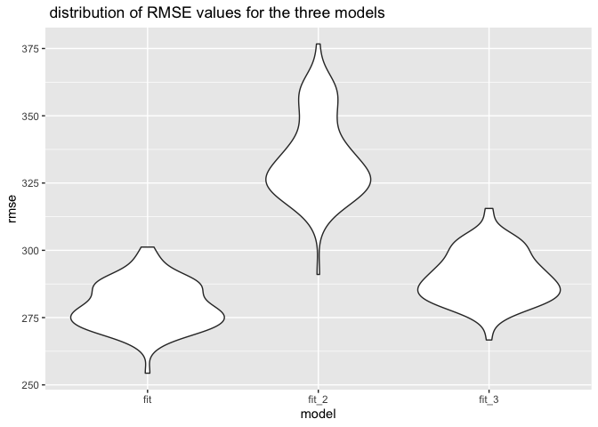

hw6
================
sze pui
11/28/2021

#Problem 1 ##tidy data lets import and clean the library first… For
tidying data we have mainly two tasks: 1.convert numeric to factor where
appropriate 2.check for missing data

``` r
#task 1 convert numeric to factor where appropriate
birthweight_df =read_csv("data/birthweight.csv") %>% 
  janitor::clean_names()%>% 
  #convert babysex,frace,malform,mrace into factor and recode them 
  mutate( babysex= as.factor(babysex),
          frace= as.factor(frace),
          malform = as.factor(malform),
          mrace = as.factor(mrace))%>% 
  #babysex: baby’s sex (male = 1, female = 2)
  mutate(babysex=  recode(babysex,"1" = "male","2"= "female"),
         frace= recode(frace,"1" = "white", "2" = "black", "3" = "asian", "4" = "puerto rican", "8" = "other", "9" = "unknown"),
        malform=  recode(malform,"0" = "absent", "1" = "present" ),
        mrace = recode(mrace,"1" = "White", "2" = "Black", "3" = "Asian", "4" = "Puerto Rican", "8" = "Other")) %>% 
                           rename(dad_race = frace, mom_race = mrace)
```

    ## Rows: 4342 Columns: 20

    ## ── Column specification ────────────────────────────────────────────────────────
    ## Delimiter: ","
    ## dbl (20): babysex, bhead, blength, bwt, delwt, fincome, frace, gaweeks, malf...

    ## 
    ## ℹ Use `spec()` to retrieve the full column specification for this data.
    ## ℹ Specify the column types or set `show_col_types = FALSE` to quiet this message.

``` r
#task 2  check for missing data
sum(is.na(birthweight_df))
```

    ## [1] 0

There is no missing data in the birthweight dataframe, therefore we dont
habe to deal with the missing data using such as na.omit()/drop_na()

##Regression model Propose a regression model for birthweight.

When I run the linear regression with all variables, I only keep the
variables showing a very small p-values. A small p value of a variable
indicates that it is significant to the baby’s birthweight.For example,
menarche ,mother’s age at menarche, is eliminated since it has a large
p-value with 2.261406e-01  
Therefore, based on the above selection rule, I selected the following
variables with very small varibales as predictors: baby’s head
circumference , baby’s length, mother’s weight,babysex, family monthly
income, gestational age,mom’s age, mother’s pre-pregnancy BMI, average
number of cigarettes smoked per day during pregnancy

``` r
#Model fitting
fit = lm(bwt ~ blength +bhead + delwt+ babysex +fincome +gaweeks +momage +ppbmi +smoken , data = birthweight_df) 
 
#tidying output 
fit %>% 
  broom::tidy() %>% 
  select(term, estimate, p.value)%>% 
  knitr::kable(digits = 3)
```

| term          |  estimate | p.value |
|:--------------|----------:|--------:|
| (Intercept)   | -6115.005 |       0 |
| blength       |    77.486 |       0 |
| bhead         |   134.626 |       0 |
| delwt         |     3.546 |       0 |
| babysexfemale |    30.909 |       0 |
| fincome       |     1.009 |       0 |
| gaweeks       |    12.675 |       0 |
| momage        |     4.120 |       0 |
| ppbmi         |   -14.059 |       0 |
| smoken        |    -2.821 |       0 |

Let’s do the diagnostics and show a plot of model residuals against
fitted values – use add_predictions and add_residuals in making this
plot.

``` r
birthweight_df %>% 
  modelr::add_residuals(fit) %>% 
   modelr::add_predictions(fit) %>% 
  ggplot(aes(x = pred, y = resid)) + geom_point()+
   labs(x ="predicted baby’s birth weight (grams)", 
        y= "residuals", 
        title = "scatterplots of residuals against fitted values of fit_1")
```

<!-- -->

#Comparision to two other models fit_2: One using length at birth and
gestational age as predictors (main effects only) fit_3: One using head
circumference, length, sex, and all interactions (including the
three-way interaction) between these

``` r
#length at birth and gestational age as predictors
fit_2 = lm(bwt ~  blength +gaweeks, data = birthweight_df)

birthweight_df %>% 
  modelr::add_residuals(fit_2) %>% 
   modelr::add_predictions(fit_2) %>% 
  ggplot(aes(x = pred, y = resid)) + geom_point()+
   labs(x ="predicted baby’s birth weight (grams)", 
        y= "residuals", 
        title = "scatterplots of residuals against fitted values of fit_2")
```

<!-- -->

``` r
 # head circumference, length, sex, and all interactions ,noticed that the interaction between predictors can be caclulated by using multiply
# two way interaction includes:babysex* bhead , babysex*blength, blenght*bhead 
#three way interaction : babysex*bhead*blength
fit_3 = lm(bwt ~ babysex + bhead + blength + babysex* bhead + babysex*blength + blength*bhead + babysex*bhead*blength, data = birthweight_df)

birthweight_df %>% 
  modelr::add_residuals(fit_3) %>% 
   modelr::add_predictions(fit_3) %>% 
  ggplot(aes(x = pred, y = resid)) + geom_point()+
   labs(x ="predicted baby’s birth weight (grams)", 
        y= "residuals", 
        title = "scatterplots of residuals against fitted values of fit_3")
```

<!-- -->

## Comparison in terms of the cross-validated prediction error

``` r
#crossv_mc preforms the training / testing split multiple times
cv_df = 
  crossv_mc(birthweight_df, 100) 

#double check for no repetitive..
cv_df %>% pull(train) %>% .[[1]] %>% as_tibble
```

    ## # A tibble: 3,473 × 20
    ##    babysex bhead blength   bwt delwt fincome dad_race gaweeks malform menarche
    ##    <fct>   <dbl>   <dbl> <dbl> <dbl>   <dbl> <fct>      <dbl> <fct>      <dbl>
    ##  1 female     34      51  3629   177      35 white       39.9 absent        13
    ##  2 male       34      48  3062   156      65 black       25.9 absent        14
    ##  3 female     36      50  3345   148      85 white       39.9 absent        12
    ##  4 male       34      52  3062   157      55 white       40   absent        14
    ##  5 female     34      52  3374   156       5 white       41.6 absent        13
    ##  6 female     33      46  2523   126      96 black       40.3 absent        14
    ##  7 female     33      49  2778   140       5 white       37.4 absent        12
    ##  8 male       36      52  3515   146      85 white       40.3 absent        11
    ##  9 male       33      50  3459   169      75 black       40.7 absent        12
    ## 10 female     35      51  3317   130      55 white       43.4 absent        13
    ## # … with 3,463 more rows, and 10 more variables: mheight <dbl>, momage <dbl>,
    ## #   mom_race <fct>, parity <dbl>, pnumlbw <dbl>, pnumsga <dbl>, ppbmi <dbl>,
    ## #   ppwt <dbl>, smoken <dbl>, wtgain <dbl>

``` r
cv_df %>% pull(test) %>% .[[1]] %>% as_tibble
```

    ## # A tibble: 869 × 20
    ##    babysex bhead blength   bwt delwt fincome dad_race gaweeks malform menarche
    ##    <fct>   <dbl>   <dbl> <dbl> <dbl>   <dbl> <fct>      <dbl> <fct>      <dbl>
    ##  1 male       33      52  3374   129      55 white       40.7 absent        12
    ##  2 female     36      52  3629   154      65 white       40.3 absent        11
    ##  3 male       38      53  3799   167      75 white       39.9 absent        12
    ##  4 female     34      54  3345   130      95 white       42.1 absent        10
    ##  5 female     34      51  3232   155      55 white       41.6 absent        15
    ##  6 female     34      51  3175   142      96 white       42.3 absent        17
    ##  7 female     34      49  3317   142      35 white       40.4 absent        12
    ##  8 female     34      49  3033   128      25 white       41.1 absent        12
    ##  9 female     30      42  2013   150      65 black       37.7 absent        13
    ## 10 male       34      52  3033   172      85 white       41.1 absent        16
    ## # … with 859 more rows, and 10 more variables: mheight <dbl>, momage <dbl>,
    ## #   mom_race <fct>, parity <dbl>, pnumlbw <dbl>, pnumsga <dbl>, ppbmi <dbl>,
    ## #   ppwt <dbl>, smoken <dbl>, wtgain <dbl>

``` r
#turn the results of training and testing into tibble
cv_df =
  cv_df %>% 
  mutate(
    train = map(train, as_tibble),
    test = map(test, as_tibble))

cv_df = cv_df %>% 
  mutate(
    fit =map(train, ~lm(bwt ~ blength +bhead + delwt+ babysex +fincome +gaweeks +momage +ppbmi +smoken ,data = .)),
    fit_2 =map(train, ~lm(bwt ~  blength +gaweeks, data = .)),
    fit_3 = map(train,~lm(bwt ~ babysex + bhead + blength + babysex* bhead + babysex*blength + blength*bhead + babysex*bhead*blength, data = .)))%>% 
  mutate(
    rmse_fit = map2_dbl(fit, test, ~rmse(model = .x, data = .y)),
    rmse_fit_2 = map2_dbl(fit_2, test, ~rmse(model = .x, data = .y)),
    rmse_fit_3= map2_dbl(fit_3, test, ~rmse(model = .x, data = .y)))
#P.S :it runs slowly
```

The plot below shows the distribution of RMSE values for each candidate
model.

``` r
cv_df %>% 
  select(starts_with("rmse")) %>% 
  pivot_longer(
    everything(),
    names_to = "model", 
    values_to = "rmse",
    names_prefix = "rmse_") %>% 
  mutate(model = fct_inorder(model)) %>% 
  ggplot(aes(x = model, y = rmse)) + geom_violin()+
    labs( title = " distribution of RMSE values for the three models ")
```

<!-- -->

It can be seen that my model(fit) has the least rmse, suggesting that it
maybe the best prediction model when compared to the two other
models(fit_2, fit_3)

#Problem 2
