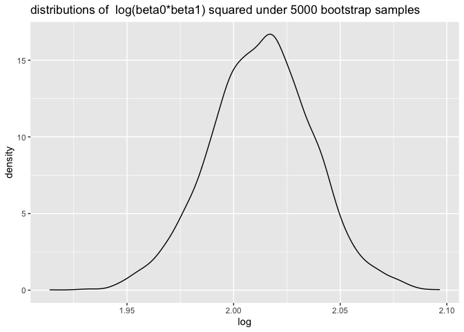

hw6
================
sze pui
11/28/2021

#Problem 1 ##tidy data lets import and clean the library first… For
tidying data we have mainly two tasks: 1.convert numeric to factor where
appropriate 2.check for missing data

``` r
#task 1 convert numeric to factor where appropriate
birthweight_df =read_csv("data/birthweight.csv") %>% 
  janitor::clean_names()%>% 
  #convert babysex,frace,malform,mrace into factor and recode them 
  mutate( babysex= as.factor(babysex),
          frace= as.factor(frace),
          malform = as.factor(malform),
          mrace = as.factor(mrace))%>% 
  #babysex: baby’s sex (male = 1, female = 2)
  mutate(babysex=  recode(babysex,"1" = "male","2"= "female"),
         frace= recode(frace,"1" = "white", "2" = "black", "3" = "asian", "4" = "puerto rican", "8" = "other", "9" = "unknown"),
        malform=  recode(malform,"0" = "absent", "1" = "present" ),
        mrace = recode(mrace,"1" = "White", "2" = "Black", "3" = "Asian", "4" = "Puerto Rican", "8" = "Other")) %>% 
                           rename(dad_race = frace, mom_race = mrace)
```

    ## Rows: 4342 Columns: 20

    ## ── Column specification ────────────────────────────────────────────────────────
    ## Delimiter: ","
    ## dbl (20): babysex, bhead, blength, bwt, delwt, fincome, frace, gaweeks, malf...

    ## 
    ## ℹ Use `spec()` to retrieve the full column specification for this data.
    ## ℹ Specify the column types or set `show_col_types = FALSE` to quiet this message.

``` r
#task 2  check for missing data
sum(is.na(birthweight_df))
```

    ## [1] 0

There is no missing data in the birthweight dataframe, therefore we dont
habe to deal with the missing data using such as na.omit()/drop_na()

##Regression model Propose a regression model for birthweight.

When I run the linear regression with all variables, I only keep the
variables showing a very small p-values. A small p value of a variable
indicates that it is significant to the baby’s birthweight.For example,
menarche ,mother’s age at menarche, is eliminated since it has a large
p-value with 2.261406e-01  
Therefore, based on the above selection rule, I selected the following
variables with very small varibales as predictors: baby’s head
circumference , baby’s length, mother’s weight,babysex, family monthly
income, gestational age,mom’s age, mother’s pre-pregnancy BMI, average
number of cigarettes smoked per day during pregnancy

``` r
#Model fitting
fit = lm(bwt ~ blength +bhead + delwt+ babysex +fincome +gaweeks +momage +ppbmi +smoken , data = birthweight_df) 
 
#tidying output 
fit %>% 
  broom::tidy() %>% 
  select(term, estimate, p.value)%>% 
  knitr::kable(digits = 3)
```

| term          |  estimate | p.value |
|:--------------|----------:|--------:|
| (Intercept)   | -6115.005 |       0 |
| blength       |    77.486 |       0 |
| bhead         |   134.626 |       0 |
| delwt         |     3.546 |       0 |
| babysexfemale |    30.909 |       0 |
| fincome       |     1.009 |       0 |
| gaweeks       |    12.675 |       0 |
| momage        |     4.120 |       0 |
| ppbmi         |   -14.059 |       0 |
| smoken        |    -2.821 |       0 |

Let’s do the diagnostics and show a plot of model residuals against
fitted values – use add_predictions and add_residuals in making this
plot.

``` r
birthweight_df %>% 
  modelr::add_residuals(fit) %>% 
   modelr::add_predictions(fit) %>% 
  ggplot(aes(x = pred, y = resid)) + geom_point()+
   labs(x ="predicted baby’s birth weight (grams)", 
        y= "residuals", 
        title = "scatterplots of residuals against fitted values of fit_1")
```

<!-- -->

#Comparision to two other models fit_2: One using length at birth and
gestational age as predictors (main effects only) fit_3: One using head
circumference, length, sex, and all interactions (including the
three-way interaction) between these

``` r
#length at birth and gestational age as predictors
fit_2 = lm(bwt ~  blength +gaweeks, data = birthweight_df)

birthweight_df %>% 
  modelr::add_residuals(fit_2) %>% 
   modelr::add_predictions(fit_2) %>% 
  ggplot(aes(x = pred, y = resid)) + geom_point()+
   labs(x ="predicted baby’s birth weight (grams)", 
        y= "residuals", 
        title = "scatterplots of residuals against fitted values of fit_2")
```

<!-- -->

``` r
 # head circumference, length, sex, and all interactions ,noticed that the interaction between predictors can be caclulated by using multiply
# two way interaction includes:babysex* bhead , babysex*blength, blenght*bhead 
#three way interaction : babysex*bhead*blength
fit_3 = lm(bwt ~ babysex + bhead + blength + babysex* bhead + babysex*blength + blength*bhead + babysex*bhead*blength, data = birthweight_df)

birthweight_df %>% 
  modelr::add_residuals(fit_3) %>% 
   modelr::add_predictions(fit_3) %>% 
  ggplot(aes(x = pred, y = resid)) + geom_point()+
   labs(x ="predicted baby’s birth weight (grams)", 
        y= "residuals", 
        title = "scatterplots of residuals against fitted values of fit_3")
```

<!-- -->

## Comparison in terms of the cross-validated prediction error

``` r
#crossv_mc preforms the training / testing split multiple times
cv_df = 
  crossv_mc(birthweight_df, 100) 

#double check for no repetitive..
cv_df %>% pull(train) %>% .[[1]] %>% as_tibble
```

    ## # A tibble: 3,473 × 20
    ##    babysex bhead blength   bwt delwt fincome dad_race gaweeks malform menarche
    ##    <fct>   <dbl>   <dbl> <dbl> <dbl>   <dbl> <fct>      <dbl> <fct>      <dbl>
    ##  1 female     34      51  3629   177      35 white       39.9 absent        13
    ##  2 male       34      52  3062   157      55 white       40   absent        14
    ##  3 female     34      52  3374   156       5 white       41.6 absent        13
    ##  4 male       33      52  3374   129      55 white       40.7 absent        12
    ##  5 female     33      46  2523   126      96 black       40.3 absent        14
    ##  6 male       36      52  3515   146      85 white       40.3 absent        11
    ##  7 male       33      50  3459   169      75 black       40.7 absent        12
    ##  8 male       35      51  3459   146      55 white       39.4 absent        12
    ##  9 female     35      48  3175   158      75 white       39.7 absent        13
    ## 10 male       36      53  3629   147      75 white       41.3 absent        11
    ## # … with 3,463 more rows, and 10 more variables: mheight <dbl>, momage <dbl>,
    ## #   mom_race <fct>, parity <dbl>, pnumlbw <dbl>, pnumsga <dbl>, ppbmi <dbl>,
    ## #   ppwt <dbl>, smoken <dbl>, wtgain <dbl>

``` r
cv_df %>% pull(test) %>% .[[1]] %>% as_tibble
```

    ## # A tibble: 869 × 20
    ##    babysex bhead blength   bwt delwt fincome dad_race gaweeks malform menarche
    ##    <fct>   <dbl>   <dbl> <dbl> <dbl>   <dbl> <fct>      <dbl> <fct>      <dbl>
    ##  1 male       34      48  3062   156      65 black       25.9 absent        14
    ##  2 female     36      50  3345   148      85 white       39.9 absent        12
    ##  3 female     33      49  2778   140       5 white       37.4 absent        12
    ##  4 female     35      51  3317   130      55 white       43.4 absent        13
    ##  5 female     33      49  2551   120      75 black       38.1 absent        11
    ##  6 female     35      57  3374   147      45 white       39.6 absent        12
    ##  7 female     36      51  2977   135      45 white       41.7 absent        13
    ##  8 female     33      49  2948   129      25 white       41   absent        13
    ##  9 male       35      51  3345   145      75 white       41.3 absent        12
    ## 10 male       35      52  3232   121      75 asian       42.3 absent        13
    ## # … with 859 more rows, and 10 more variables: mheight <dbl>, momage <dbl>,
    ## #   mom_race <fct>, parity <dbl>, pnumlbw <dbl>, pnumsga <dbl>, ppbmi <dbl>,
    ## #   ppwt <dbl>, smoken <dbl>, wtgain <dbl>

``` r
#turn the results of training and testing into tibble
cv_df =
  cv_df %>% 
  mutate(
    train = map(train, as_tibble),
    test = map(test, as_tibble))

cv_df = cv_df %>% 
  mutate(
    fit =map(train, ~lm(bwt ~ blength +bhead + delwt+ babysex +fincome +gaweeks +momage +ppbmi +smoken ,data = .)),
    fit_2 =map(train, ~lm(bwt ~  blength +gaweeks, data = .)),
    fit_3 = map(train,~lm(bwt ~ babysex + bhead + blength + babysex* bhead + babysex*blength + blength*bhead + babysex*bhead*blength, data = .)))%>% 
  mutate(
    rmse_fit = map2_dbl(fit, test, ~rmse(model = .x, data = .y)),
    rmse_fit_2 = map2_dbl(fit_2, test, ~rmse(model = .x, data = .y)),
    rmse_fit_3= map2_dbl(fit_3, test, ~rmse(model = .x, data = .y)))
#P.S :it runs slowly
```

The plot below shows the distribution of RMSE values for each candidate
model.

``` r
cv_df %>% 
  select(starts_with("rmse")) %>% 
  pivot_longer(
    everything(),
    names_to = "model", 
    values_to = "rmse",
    names_prefix = "rmse_") %>% 
  mutate(model = fct_inorder(model)) %>% 
  ggplot(aes(x = model, y = rmse)) + geom_violin()+
    labs( title = " distribution of RMSE values for the three models ")
```

<!-- -->

It can be seen that my model(fit) has the least rmse, suggesting that it
maybe the best prediction model when compared to the two other
models(fit_2, fit_3)

#Problem 2 Lets load the data first!

``` r
weather_df = 
  rnoaa::meteo_pull_monitors(
    c("USW00094728"),
    var = c("PRCP", "TMIN", "TMAX"), 
    date_min = "2017-01-01",
    date_max = "2017-12-31") %>%
  mutate(
    name = recode(id, USW00094728 = "CentralPark_NY"),
    tmin = tmin / 10,
    tmax = tmax / 10) %>%
  select(name, id, everything())
```

    ## Registered S3 method overwritten by 'hoardr':
    ##   method           from
    ##   print.cache_info httr

    ## using cached file: ~/Library/Caches/R/noaa_ghcnd/USW00094728.dly

    ## date created (size, mb): 2021-11-19 15:08:27 (7.613)

    ## file min/max dates: 1869-01-01 / 2021-11-30

##Boostraping by using modelr

``` r
#Boostrapping 
bootstrap = weather_df %>% 
  #rename the id to strap number 
  bootstrap(5000, id="strap_number" ) %>% 
  mutate(
    models = map(.x = strap, ~lm(tmax~tmin, data = .x)), 
    results_log = map(models, broom::tidy),
    result_r2 = map(models,broom::glance)
  ) %>% 
  select(strap_number, results_log,result_r2) %>% 
  unnest( results_log,result_r2)
```

    ## Warning: unnest() has a new interface. See ?unnest for details.
    ## Try `df %>% unnest(c(results_log, result_r2))`, with `mutate()` if needed

## distribution plot and 95% confidence interval of r -squares

``` r
#Look at the distributions of r squared under repeating sampling

bootstrap %>% 
  filter(term =="tmin") %>% 
  ggplot(aes(x = r.squared))+
    geom_density()+ 
  labs(title = "distributions of r squared under 5000 bootstrap samples")
```

<!-- -->

``` r
#the 95% confidence interval of r squared
cl_of_r2 = bootstrap  %>% 
  summarize(
    # 2.5% quantiles
    ci_lower = quantile(r.squared, 0.025),
    # 97.5% quantiles
    ci_upper = quantile(r.squared, 0.975)
  )
```

From the plot, it can be seen that after bootstraping the samples for
5000 times, the distribution of r-squares is slightly skewed. The upper
and lower Cl for r-squares is 0.9272966 and 0.8945596

## distribution plot and 95% confidence interval of log(beta0\*beta1)

``` r
log_df = bootstrap %>% 
  select(term, estimate)%>%
  #beta 0 stands for the intercept 
  mutate(term = recode( term,`(Intercept)` = "beta0", "tmin" ="beta1"))%>% 
  pivot_wider(
    names_from = "term",
    values_from = "estimate") %>%
  unnest(beta0,beta1) %>%
  mutate(log = log(beta0*beta1))
```

    ## Warning: Values are not uniquely identified; output will contain list-cols.
    ## * Use `values_fn = list` to suppress this warning.
    ## * Use `values_fn = length` to identify where the duplicates arise
    ## * Use `values_fn = {summary_fun}` to summarise duplicates

    ## Warning: unnest() has a new interface. See ?unnest for details.
    ## Try `df %>% unnest(c(beta0, beta1))`, with `mutate()` if needed

``` r
#Look at the distributions of log() under repeating sampling

log_df%>% 
  ggplot(aes(x = log)) +
    geom_density()+
  labs(title = "distributions of  log(beta0*beta1) squared under 5000 bootstrap samples")
```

<!-- -->

``` r
#the 95% confidence interval of log(beta0*beta1)
cl_of_log = log_df  %>% 
  summarize(
    # 2.5% quantiles
    ci_lower = quantile(log, 0.025),
    # 97.5% quantiles
    ci_upper = quantile(log, 0.975)
  )
```

From the plot, it can be seen that after bootstraping the samples for
5000 times, the distribution of log(beta0*beta1) is slightly skewed. The
upper and lower Cl for log(beta0*beta1) is 2.05773 and 1.966084
